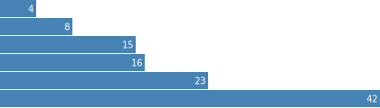

export-svg-chart [](https://www.npmjs.com/package/export-svg-chart) [](https://travis-ci.org/ThibWeb/export-svg-chart) [](https://david-dm.org/ThibWeb/export-svg-chart) [](https://david-dm.org/ThibWeb/export-svg-chart)
================

## Install

```sh
npm install export-svg-chart --save
```

## Example

```js
const fs = require('fs');
const exportSvgChart = require('export-svg-chart');

const options = {
    url: 'http://bl.ocks.org/mbostock/raw/7341714/',
    selector: '.chart',
};

exportSvgChart(options, (err, buffers) => {
    if (err) return console.log(err);

    fs.writeFile('basic-example.svg', buffers.svg);
    fs.writeFile('basic-example.png', buffers.pngs);
});
```

http://bl.ocks.org/mbostock/raw/7341714/ becomes:

[](./basic-example.png)
[](./basic-example.svg)
